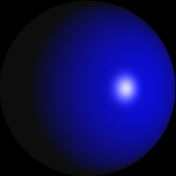

# Rendering Images Using LaTeX

As an example of LaTeX's Turing completeness and capabilities to do floating point arithmetic, this repository demonstrates how to use LaTeX to render a sphere using [Phong shading](https://en.wikipedia.org/wiki/Phong_shading). The images below are rendered using LaTeX.

See [shading.pdf](./shading.pdf) for more details about shading parameters.

## Requirements

- LaTeX compiler
- Linux system (for running Makefiles)
- Python 3.6+ with [Pillow](https://pypi.org/project/Pillow/)

Use the `Makefile` to generate the images.

## Why is Python required

- LaTeX cannot output binary file directly (see discussion [here](https://tex.stackexchange.com/questions/8729/write-non-printable-ascii-characters-to-a-file), LaTeX can output arbitrary bytes, but it will also output `\x0A` after each `\write` call)
    - To cope with this issue, we use LaTeX to output the byte in decimal format, and use Python to convert them into binary
    - Note that if LuaTeX is used, Lua can be used to write binary output

- LaTeX cannot include BMP files directly
    - For simplicity, the rendered pixels are saved using the BMP format
    - However, (most) LaTeX distributions cannot use BMP files directly
    - We use Python to convert BMP images into PNG so that they can be included in the PDF file

Because Python is used, `-shell-escape` option must be enabled during compiling.

## What is implemented

- A pure LaTeX implementation for writing BMP image files
- A pure LaTeX implementation for Phong shading